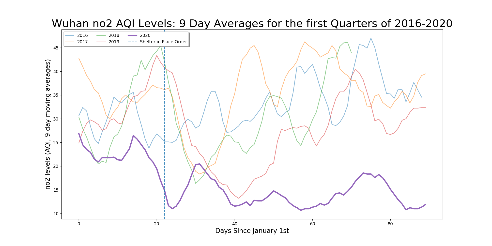
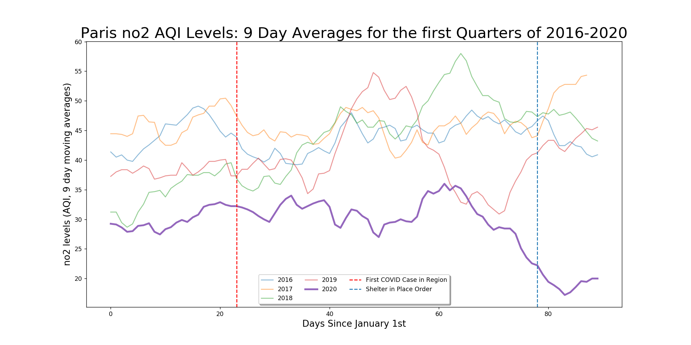

# Capstone 1: Airborne – Quarantine and Air Quality in Cities Around the World

For this project, I decided to investigate the effect that the COVID-19 epidemic and subsequent quarantines are having on air quality. After seeing numerous claims on social media that implied that the air and water were much cleaner in places that instituted a lockdown, I was curious to see if this effect was real and, if so, how closely the changes tracked the spread of the virus and government measures in responses.

These changes in air quality are significant not only as a curiosity or measure of how everyday activities affect the environment: both of the types of air pollution I focused on, NO2 and PM2.5 can contribute to chronic lung disease and lead to a lower quality of life and even premature death when present in sufficient quantities. 

This is especially significant during the coronavirus epidemic: (a study released on April 8th)[https://projects.iq.harvard.edu/covid-pm] found a significant link between long term PM2.5 exposure and increased mortality rates from COVID-19. 

## The Data

The World Air Quality Index Project is a small organization based in China that collects readings from air quality monitoring stations around the world and standardizes them using E.P.A. guidelines into AQI, or Air Quality Index, units.

Unfortunately, the type of airborne particle that different stations report is not uniform – all of the stations I looked at report PM2.5 concentrations (particulate matter 2.5 micrometers or less), but reporting of PM10 (between 2.5 and 10 micrometers). NO2 (Nitrogen Dioxide), CO (carbon monoxide), and SO2 (sulfur dioxide) is sporadic. Many stations have daily values dating back to the beginning of 2014, but quite a few began reporting more recently, and often there are gaps in the reporting, ranging from a day or two to several months. 

I had to download the datasets individually, so I decided to focus on stations that had PM2.5 and  NO2 dating back to 2014. The other pollutants were too sporadic to find data for in the range of cities I wanted to look at. Most NO2 comes from automobile traffic and in burning fossil fuels, so it seemed like a good pollutant to focus on in addition to PM2.5. 

Both NO2 and PM2.5 can contribute to chronic lung disease and lead to a lower quality of life and even premature death when present in sufficient quantities. 

This is especially significant during the coronavirus epidemic: a study that was released on April 8th found a significant link between long term PM2.5 exposure and increased mortality rates from COVID-19. 

AQI units are not linealy scaled to concentrations of particulate matter, but rather to the relative levels of danger to human health – (cont)

### The cities...

### EDA

I began by converting loading the CSV file for Denver into a dataframe and, after cleaning up the data I was interested in, generated a scatterplot for PM2.5 and NO2 concentrations: 

I realized that a major obstacle to discerning if COVID-19 had lead to a significant drop in these pollutants was that they exhibit seasonal variation, especially NO2 AQI levels, which tend to spike around New Years.  

I subsequently created a pipeline script to clean other datasets and save them as picklefiles, and generated scatterplots for a number of other cities, including in the southern hemisphere where the pattern would likely be reversed if it was driven by weather. 

Cities in Europe and China in the northern hemisphere seemed to generally follow the same pattern, while cities in the southern hemisphere were the opposite. Below I have plotted the readings for PM2.5 and NO2 in Madrid and Santiago de Chile, and you can see that their peaks and valleys are opposite. 

I also realized that it was important to look back several years because certain events could cause big distortions in the data; for instance, consider the effect of the Austrailian wildfires of 2019 on PM2.5 readings in Sydney:

Given the periodicity of the concentrations, I thought it would make the most sense to plot the values for the first three months in different years to get a better sense how the trajectory of PM2.5 and NO2 was different. 

While I was working on initial exploration of the data earlier this week, the World Air Quality Project Index released a detailed dataset with hourly values for 380 cities around the world, but because the data only spanned from January 1st 2020 to present and given the seasonal variations I had noticed, I decided to stick with the data I had that spanned several years.

To make the graphs easier to interpret, I created a function that would generate variably sized moving window averages to smooth the data, which resulted in something much easier to process. I wrote a script for a plotting function that would generate a graph based on arguments passed in for the picklefile, the type of pollutant in question, the starting year (in case I wanted to plot a dataset that started later). 

I also spent some time researching the spread of COVID in the different U.S. states and countries I had picked monitoring stations for focus on, and created a dictionary to associate these dates with the picklefiles for the dataframes I had cleaned. 

